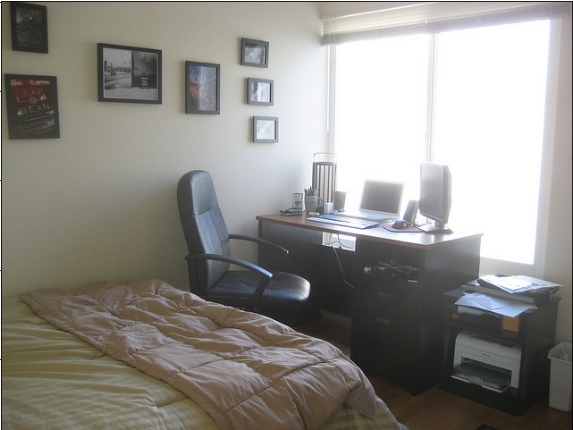
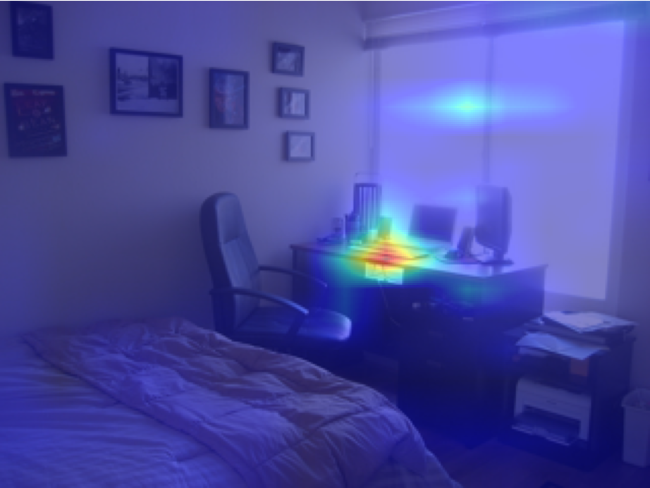

## attention map visualization

### pre-requisite
```bash
$ pip install opencv-python
$ pip install matplotlib
$ pip install Pillow
$ pip install numpy
```

### Contents
- __Version1__ is here [visualize_attention_map.py](https://github.com/rentainhe/visualization/blob/master/visualize_attention_map/visualize_attention_map.py)
- __Version2__ is here [visualize_attention_map_V2.py](https://github.com/rentainhe/visualization/blob/master/visualize_attention_map/visualize_attention_map_V2.py)

just choose the one you like

the attention style in version2 can be changed by "cmap", choose the color map you like [here](https://matplotlib.org/2.0.2/examples/color/colormaps_reference.html)

### Result
#### 1. Version1 example
- __original image__


 
- __image with attention__ (for example we use random attention map here)


#### 2. Version2 example
- __original image__


 
- __image with attention__ (for example we use random attention map here)

