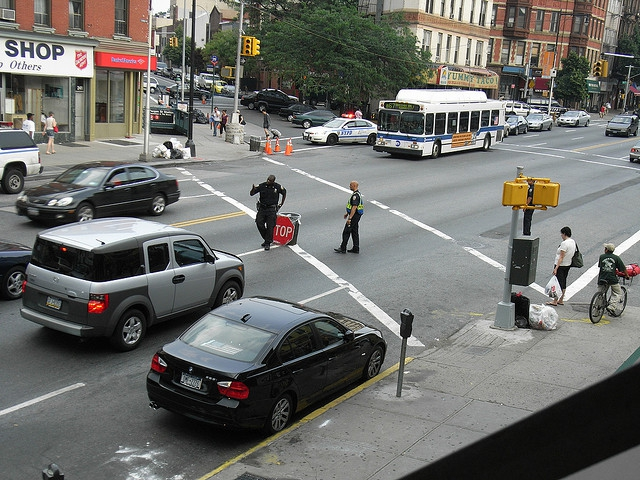
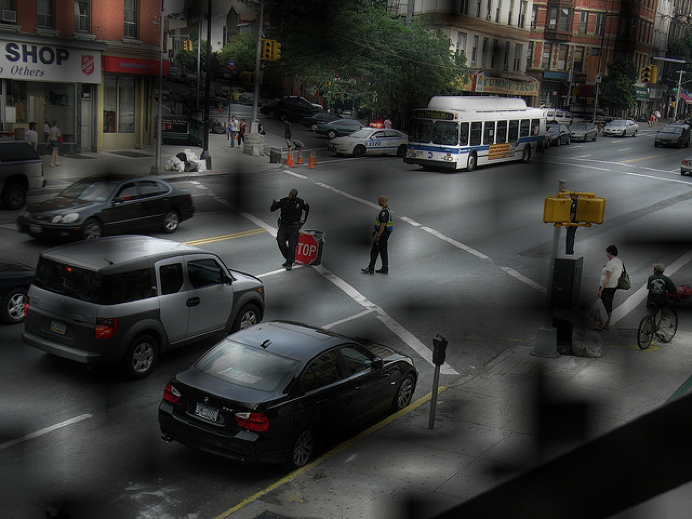

## attention map visualization

### pre-requisite
```bash
$ pip install opencv-python
$ pip install matplotlib
$ pip install Pillow
$ pip install numpy
```

### Contents
- Relative Code is here [visualize_attention_map.py](https://github.com/rentainhe/visualization/blob/master/visualize_attention_map/visualize_attention_map.py)

### Result
- __original image__


 
- __image with attention__ (for example we use random attention map here)



