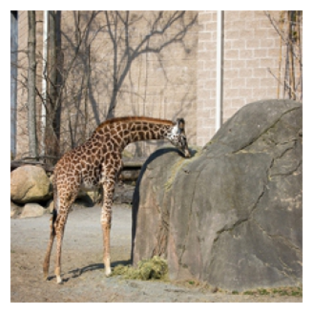
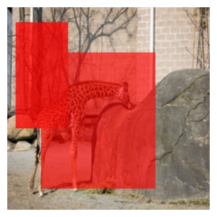

## attention map visualization

### pre-requisite
```bash
$ pip install opencv-python
$ pip install matplotlib
$ pip install Pillow
$ pip install numpy
```

### Contents
- __code__ is here [__region_attention_visualization.py__](https://github.com/rentainhe/visualization/blob/master/visualize_region_attention/region_attention_visualization.py)

当前版本还有改进空间, 改进后会更新至github

### Results
#### original figure


#### with region attention
